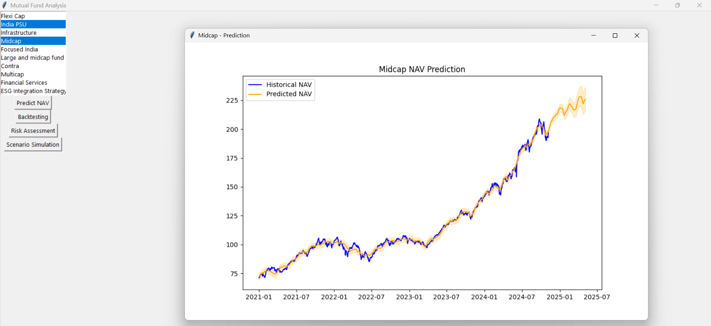

# Mutual Fund Analysis & Prediction Tool

A desktop application built with Python for comprehensive analysis, prediction, and simulation of mutual fund Net Asset Value (NAV). This tool leverages the power of Prophet for time-series forecasting, Matplotlib for visualization, and Tkinter for a user-friendly graphical interface.

![Main Application Window]:-  

## 📋 Features

* **📈 NAV Prediction**: Utilizes Facebook's Prophet model, fine-tuned with multiplicative seasonality, to forecast future fund NAVs for the next 6 months.
* **⚖️ Risk Assessment**: Calculates and visualizes key risk metrics like **Value at Risk (VaR)** and **Conditional Value at Risk (CVaR)** to quantify potential losses.
* **💹 Investment Backtesting**: Compares the performance of two popular investment strategies: **Buy and Hold** (lump-sum investment) versus a **Systematic Investment Plan (SIP)**.
* **🎲 Monte Carlo Simulation**: Runs thousands of simulations to project a range of possible future NAV paths, providing a probabilistic view of potential outcomes.
* **🖥️ Multi-Fund Analysis**: A clean GUI allows you to select and analyze multiple funds simultaneously, with each analysis opening in a separate, clear window.

---

## 🚀 Technology Stack

* **Backend**: Python
* **Time-Series Forecasting**: `prophet` (by Facebook)
* **Data Manipulation**: `pandas`, `numpy`
* **Data Visualization**: `matplotlib`
* **GUI**: `tkinter`

---

## ⚙️ Setup and Installation

Follow these steps to get the application running on your local machine.

### 1. Prerequisites

* Python 3.8 or higher
* Git

### 2. Clone the Repository

```bash
git clone [https://github.com/your-username/your-repo-name.git](https://github.com/your-username/your-repo-name.git)
cd your-repo-name
